# 🏛️ DigitalNagrik

<div align="center">


### 🚀 Smart AI-Powered Civic & Cyber Issue Reporting Platform

**Report Issues. Track Progress. Make a Difference.**

[🎯 Quick Start](#-quick-start) • [✨ Features](#-what-makes-DigitalNagrik-special) • [🛠️ Stack](#️-tech-stack) • [📸 Screenshots](#-preview)

</div>

---

## 💡 What is DigitalNagrik?

Ever seen a pothole, broken streetlight, or experienced a cyber scam and wanted to report it? **DigitalNagrik makes it dead simple.**

```
👤 Citizen Reports Issue → 🤖 AI Detects Type (2 min) → 📍 Maps Location → 
🏛️ Admin Gets Alert → ⚡ Auto-Prioritizes if Ignored → ✅ Problem Solved!
```

---

## ✨ What Makes DigitalNagrik Special?

<table>
<tr>
<td width="50%">

### 🤖 **AI That Actually Works**
- Detects if it's Civic or Cyber in **under 2 minutes**
- Powered by Gemini API
- No more wrong department routing!

### 📍 **Smart Location Magic**
- Auto-detects your exact location
- Creates issue heatmaps
- Helps admin prioritize by area

</td>
<td width="50%">

### ⚡ **Auto-Escalation Engine**
- Issue ignored for days? Auto-bumps priority
- No more forgotten complaints
- Real accountability

### 📱 **Works Everywhere, Even Offline**
- PWA = Works like a native app
- Report offline, syncs when online
- Desktop, tablet, mobile - all covered

</td>
</tr>
</table>

---

## 🎯 For Citizens

<div align="center">

| 📸 Report | 👀 Track | 📢 Stay Informed |
|:---:|:---:|:---:|
| Take photo, describe issue, submit | Real-time status updates | Government awareness programs |
| AI categorizes automatically | Get notified of progress | Emergency contacts |
| Location tagged instantly | See resolution timeline | Civic education resources |

</div>

---

## 👨‍💼 For Admins

```mermaid
graph LR
    A[📊 Dashboard] --> B[View All Issues]
    B --> C{Priority?}
    C -->|High| D[🔴 Urgent Queue]
    C -->|Medium| E[🟡 Normal Queue]
    C -->|Low| F[🟢 Standard Queue]
    D --> G[Assign Team]
    E --> G
    F --> G
    G --> H[✅ Mark Resolved]
```

<div align="center">



</div>

- **Real-time analytics** - See what's happening NOW
- **Smart assignment** - Route to right department automatically
- **Heat maps** - Know where issues are clustering
- **Performance tracking** - How fast are you solving problems?

---

## 🛠️ Tech Stack

<div align="center">

### Frontend


### Backend


### AI & Services


</div>

---

## 📸 Preview

<div align="center">

### 🖥️ Desktop Experience


<!--  -->

### 📱 Mobile Experience
<!--  -->


> **PWA Ready** - Install it, use it offline, get push notifications!

</div>

---

## 🚀 Quick Start

### Prerequisites Checklist
- [ ] Node.js 18+
- [ ] Java 17+
- [ ] MySQL 8+
- [ ] Redis & Kafka running

### 1️⃣ Clone & Setup Backend

```bash
git clone https://github.com/Akash-Adak/DigitalNagrik.git
cd DigitalNagrik/backend

# Edit application.properties with your DB credentials
mvn clean install
mvn spring-boot:run
```

**Backend running on** → `http://localhost:8080` ✅

### 2️⃣ Setup Frontend

```bash
cd ../frontend

npm install
npm run dev
```

**Frontend running on** → `http://localhost:5173` ✅

### 3️⃣ Configure Your APIs

Create `.env` file:
```env
VITE_API_BASE_URL=http://localhost:8080
VITE_GEMINI_API_KEY=your_key_here
```

### 4️⃣ Done! 🎉

Open browser → Start reporting issues!

---

## 🎨 How It Works


---

## 🔥 Cool Features You'll Love

### 🎯 AI Classification (2-min magic)
```javascript
Report "Broken streetlight" → AI: "Civic Issue - Infrastructure"
Report "Phishing email" → AI: "Cyber Issue - Security"
```

### 📈 Auto-Priority Escalation
```
Day 1: Normal Priority ⚪
Day 7: Not resolved? → Medium Priority 🟡
Day 14: Still pending? → High Priority 🔴
```

### 🗺️ Issue Heat Maps
Visual clusters show problem hotspots in your city!

### 🔔 Smart Notifications
- Issue submitted ✅
- Admin assigned 👨‍💼
- In progress 🔧
- Resolved 🎉

---

## 🤝 Contributing

Found a bug? Have a cool idea? **We'd love your help!**

```bash
# Fork it
# Create branch: git checkout -b cool-feature
# Commit: git commit -m 'Added something cool'
# Push: git push origin cool-feature
# Submit PR 🚀
```

---

## 📞 Need Help?

- 🐛 **Found a bug?** [Open an issue](https://github.com/Akash-Adak/DigitalNagrik/issues)
- 💡 **Have an idea?** [Start a discussion](https://github.com/Akash-Adak/DigitalNagrik/discussions)
- 📧 **Email:** support@DigitalNagrik.gov

---

## ⭐ Show Some Love

If DigitalNagrik helped your community, **star this repo!** ⭐

---

<div align="center">

### Built with ❤️ for Better Civic Engagement

**Made by [Akash Adak](https://github.com/Akash-Adak)**


</div>
